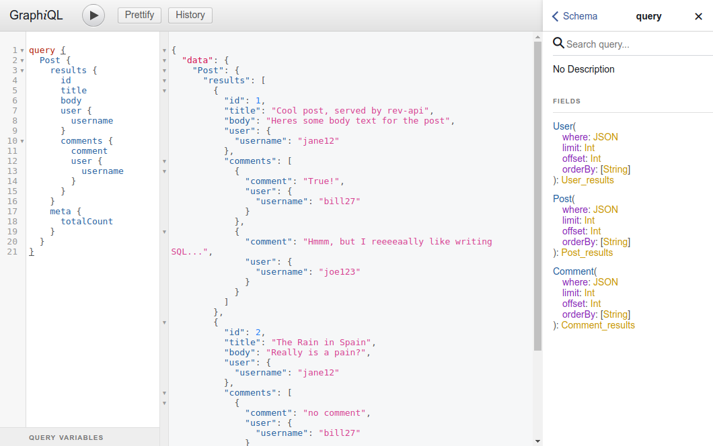

# Creating a GraphQL API

The `rev-api` module of RevJS allows you to easily make your models available
over the network, via an automatically-generated GraphQL API.

* Models are exposed via the **ModelApiManager.register()** method, and you can
  choose to expose all of your models via the API, or just a subset of them.
* You can choose which **operations** (create, read, update, remove) to allow
  on your models via the API.
* You can also expose some of your **model methods** as **GraphQL mutations**.

## Registering API Models 

The example below shows how to specify the allowed operations for specific
models, and register them with an API:

```ts
{!examples/src/creating_an_api/defining_an_api.ts!}
```

**NOTE:** The seperate import from `rev-api/lib/decorators` is designed so you
can share the same model definition between your front and back-end code,
without inadvertently including `rev-api` back-end code in your front-end
bundle.

## Exposing your API via HTTP

APIs created via `rev-api` can be exposed by any web framework that can
serve [GraphQL JS](https://github.com/graphql/graphql-js) schemas. A good
example is [Appollo GraphQL Server](https://github.com/apollographql/apollo-server)
which supports most popular NodeJS Web Frameworks.

In the example below, we use apollo graphql server to serve our API:

```ts
{!examples/src/creating_an_api/serving_an_api.ts!}
```

## GraphQL Query Schema

The GraphQL `query {}` schema lets you read models and fields in a hierarchical
way.

* RevJS generates a top-level Query object for each model you expose for
  **read** access
* You can use the standard `read()` function options (`where`, `limit`,
 `offset` and `orderBy`) when querying the top-level Query objects
* Query objects contain a `results` key, containing the matching models, and
  a `meta` key, containing the current `limit`, `offset` and `totalCount` values.
* RevJS respects the **RelatedModel** and **RelatedModelList** fields you define
  on your models, and you can drill-down on these fields to any level in your
  GraphQL query.

The screenshot below shows the GraphQL Query Schema generated from the examples
above:



## GraphQL Mutation Schema

The GraphQL `mutation {}` schema provides access to `create()`, `update()` and
`remove()` functions, for all models you have enabled these for. Any
custom API Methods you have created will also be available here.

The screenshot below shows the GraphQL Mustation Schema generated from the
examples above:


## Security

It is **very** important to consider security when exposing data via an API.
Currently you must implement security policies in your models, and at the Web
Server layer (e.g. by securiing your API with
[Passport](http://www.passportjs.org/)).

In future releases we may implement support for *middleware*, which could be used
for authentication and authorisation, but currently we do not have support for
this. Contributions welcome! :)